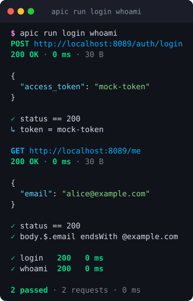

<h1 align="center">
  <br>
  apic
</h1>

<p align="center"><strong>apic is epic</strong>: run API requests from plain <code>.http</code> files, in the terminal, in CI, or from an AI agent, on any platform, with one static binary.</p>

<p align="center">
  <a href="https://github.com/dataGriff/api-caller/actions/workflows/ci.yml"></a>
  <a href="https://datagriff.github.io/api-caller/"></a>
  <a href="https://github.com/dataGriff/api-caller/releases/latest"></a>
  
  <a href="LICENSE"></a>
</p>

<p align="center"></p>

```sh
apic ui --demo                      # a fake API and a UI to poke it with, no setup
apic run login                      # POST, capture the token
apic run get-user --env staging     # reuse the token, check assertions
apic run smoke.http --json | jq     # whole file as a flow, one JSON line per request
apic test                           # run Gherkin features against the same requests
claude mcp add api -- apic mcp      # let an agent call the same requests as tools
```

## Try it in 30 seconds

No account or API key needed, and nothing to clone. `apic ui --demo` serves
a small fake API in-process and opens the terminal UI on an example project
that targets it:

```sh
go install github.com/dataGriff/api-caller/cmd/apic@latest
apic ui --demo
```

Press <kbd>enter</kbd> to send the request under the cursor, <kbd>f</kbd> to
run a whole file as a flow, <kbd>e</kbd> to switch environment and
<kbd>?</kbd> for every key. Prefer the plain CLI? `apic demo` writes the same
project to a directory and serves the API, so you can run it by hand:

```sh
apic demo                                  # terminal 1: writes ./apic-demo, serves the API
apic run login whoami -C apic-demo         # terminal 2
apic ui -C apic-demo --env local           # or the UI, same directory
```

Every command resolves `.http` files relative to `-C` (default: the current
directory), so `apic ui` on its own in that second terminal won't see the
project `apic demo` just wrote — point it at the directory explicitly.

<p align="center"></p>

## Why it's epic

Postman and Bruno are apps. VS Code and JetBrains `.http` files are great
until you leave the editor. `Taskfile` + `curl` runs anywhere but has no
environments, no chaining, no assertions and no output a program can read.

apic takes the `.http` format editors already understand and adds what the
terminal and agents need:

- **Environments** from `http-client.env.json` (the JetBrains / kulala / httpyac convention) plus `.env`, shell and `--var`.
- **Captured variables that persist.** `# @capture token = body.$.access_token` in `login` means the next `apic run get-user`, in a new shell or a new agent call, has `{{token}}`.
- **Assertions** with `# @assert status == 200`, and files that run as ordered flows with a pass/fail summary and exit code.
- **Auth that is otherwise impossible in a text file.** `# @auth aws` signs with SigV4 from your normal AWS credentials (environment, profiles, SSO via the AWS CLI) with no SDK in the binary; `# @auth oauth2` fetches, caches and refreshes tokens; `basic`, `bearer` and `exec` (any CLI that prints a token) round it out.
- **Gherkin without Cucumber.** `apic test` runs `.feature` files with a built-in step vocabulary; `# @step a user named {name} exists` on a request makes features read as behaviour.
- **A terminal UI.** `apic ui` browses the project, runs requests and flows, shows each row's status and round trip as it lands, and switches environment without leaving the keyboard.
- **Safe to log.** Sensitive headers are masked in output, on the request and the response; `--redact` masks both bodies, all header values, query values, captures and assertion values for stored CI logs, keeping status, timing and pass/fail.
- **Agent-first output.** `--json` gives a stable object per request; `list` and `describe` make requests discoverable; errors say what to do next.
- **MCP server.** `apic mcp` exposes every request as a tool for Claude Code, Cursor and friends.
- **Escape hatches.** `apic curl <id>` prints the equivalent curl; `apic import openapi.yaml` scaffolds files from a spec.

The same file is clickable in VS Code, JetBrains and Neovim, because apic's
additions are comments.

## Install

```sh
# Go 1.25+
go install github.com/dataGriff/api-caller/cmd/apic@latest

# Linux / macOS: downloads the release binary and verifies its checksum
curl -fsSL https://raw.githubusercontent.com/dataGriff/api-caller/main/install.sh | sh

# Windows and everything else: download from GitHub Releases
```

```yaml
# GitHub Actions, any runner OS: verified, cached, on PATH
- uses: dataGriff/api-caller/setup-apic@v0
```

`APIC_VERSION=v1.2.3` pins a version and `APIC_INSTALL_DIR=~/bin` chooses
where the binary lands. The installer verifies the archive against the
published `checksums.txt` and refuses to install on a mismatch; the action
does the same and takes `with: version: v1.2.3`.

Every release is signed with cosign and ships an SPDX SBOM per archive; see
[docs/verifying.md](docs/verifying.md) to check a download before trusting it.

## 60-second tour

```http
# api/auth.http
### Log in and keep the token
# @name login
# @assert status == 200
# @capture token = body.$.access_token
POST {{baseUrl}}/auth/login
Content-Type: application/json

{"user": "{{user}}", "password": "{{password}}"}

### Who am I
# @name whoami
# @assert status == 200
# @assert body.$.email endsWith @example.com
GET {{baseUrl}}/me
Authorization: Bearer {{token}}
```

```json
// api/http-client.env.json
{ "dev": { "baseUrl": "https://dev.example.com", "user": "alice" } }
// api/http-client.private.env.json  (gitignored)
{ "dev": { "password": "s3cret" } }
```

Start one with `apic init api --base-url https://dev.example.com`, or let
`apic import openapi.yaml` write the first draft from a spec.

```
$ cd api
$ apic list
ID      METHOD  URL                       FILE          DESCRIPTION
login   POST    {{baseUrl}}/auth/login    auth.http:6   Log in and keep the token
whoami  GET     {{baseUrl}}/me            auth.http:14  Who am I

$ apic run whoami --env dev
error: auth.http:14: missing variable
  {{token}}: it is captured by request "login"; run `apic run login` first, or pass --var token=...

$ apic run login --env dev
POST https://dev.example.com/auth/login
200 OK · 87 ms · 412 B
{ "access_token": "eyJ..." }
✓ status == 200
↳ token = eyJ...

$ apic run whoami --env dev
GET https://dev.example.com/me
200 OK · 41 ms · 96 B
{ "email": "alice@example.com" }
✓ status == 200
✓ body.$.email endsWith @example.com
```

Set `env: dev` in `api/apic.yaml` to drop the `--env` flag.

## Commands

| Command | What it does |
|---|---|
| `apic run <id \| file.http \| file.http#id>...` | Send a request, or a file in order as a flow. `--json`, `--body-only`, `-v` headers, `--var k=v`, `--env`, `--keep-going`, `--no-session`, `--redact`. |
| `apic ui` | Terminal UI: browse, run, inspect, switch environment. `--demo` needs no project. |
| `apic test [paths...]` | Run Gherkin features with the built-in vocabulary and `# @step` phrases. `--format pretty\|progress\|junit\|cucumber`, `--tags`, `--steps`. |
| `apic list [pattern]` | Every request: id, method, URL template, file:line, description. |
| `apic describe <id>` | Variables the request needs and where each comes from, captures, asserts, and whether it is ready. |
| `apic env` | Environments found and the variables in effect (secrets masked). |
| `apic session [clear]` | Captured values stored in `.apic/session.json`. |
| `apic curl <id>` | Equivalent curl command with variables resolved. |
| `apic init [dir]` | Scaffold a project: config, env files, a first request and a feature. |
| `apic import <openapi.yaml>` | One `.http` per tag, one named request per operation, example bodies from schemas. |
| `apic validate` | Parse every file and report problems with line, column and a code; non-zero exit on errors. `--format github` annotates a pull request, `--format sarif` feeds code scanning. |
| `apic mcp` | Serve the project to AI agents over MCP (stdio). |
| `apic demo` | Scaffold and serve a fake API (`--out`, `--port`, `--force`). |

All commands take `--json` and `-C <dir>`, and none of them prompt. `apic ui`
is the one exception, and it refuses to start without a terminal. Colour is
disabled when output is not a terminal or `NO_COLOR` is set.

**Exit codes:** `0` ok · `1` assertion or capture failed · `2` usage, parse error or missing variable · `3` network error.

## Documentation

Published at **[datagriff.github.io/api-caller](https://datagriff.github.io/api-caller/)**.

| | |
|---|---|
| [Getting started](docs/getting-started.md) | Install, first project, login flow, CI, agents |
| [Terminal UI](docs/tui.md) | What `apic ui` shows and every key it takes |
| [Cheat sheet](docs/cheatsheet.md) | Directives, selectors, operators and commands on one page |
| [Cookbook](docs/cookbook.md) | Recipes: login once, CI smoke tests, AWS, OAuth2, polling, uploads |
| [CLI reference](docs/cli.md) | Every command, flag, JSON shape and exit code |
| [The `.http` format](docs/format.md) | Directives, variables, selectors, assertions |
| [Authentication](docs/auth.md) | AWS SigV4, OAuth2, basic, bearer, exec |
| [Testing with Gherkin](docs/testing.md) | `.feature` files, the step vocabulary, reports |
| [Agents](docs/agents.md) | Shell and MCP integration, JSON contract |
| [FAQ](docs/faq.md) | Missing variables, 403s, secrets in logs, Windows |
| [Taskfile](docs/taskfile.md) | Keep `task` as the front door |
| [Comparison](docs/comparison.md) | apic against Bruno, Hurl, Postman, curl |

## For agents

Shell: `apic list --json`, `apic describe <id> --json`, `apic run <id> --json`.
MCP: `claude mcp add api -- apic mcp --dir ./api --env dev`.
See [docs/agents.md](docs/agents.md) for the JSON contract and a snippet to
paste into your project's `AGENTS.md`.

## The format

See [docs/format.md](docs/format.md) for the full spec: structure,
directives, variable precedence, built-ins, selectors and assertion
operators. Short version: standard `.http`, plus

```
# @name id
# @description one line
# @capture name = selector
# @assert selector op value
# @auth aws|oauth2|basic|...
# @step a user named {name} exists
# @no-redirect
# @no-session
# @timeout 10s
```

## Keeping a Taskfile

If your team already runs `task api:...`, keep it and delegate:

```yaml
tasks:
  api:
    desc: Run an API request, e.g. task api -- get-user --env staging
    cmds: [apic run {{.CLI_ARGS}}]
```

## Development

```sh
task build
task example:demo   # run the built-in demo project end to end
task test
task lint
```

Tests run against local `httptest` servers; no network is needed. The
`examples/httpbin` project targets httpbin.org for a live demo instead. Two
more real-world examples live under `examples/`: `github` (`bearer` auth,
`task example:github`) and `spotify` (`oauth2` client-credentials,
`task example:spotify`). Each needs your own credentials dropped into its
`http-client.private.env.json` first; see `examples/README.md`.

See [CONTRIBUTING.md](CONTRIBUTING.md) before opening a pull request, and
[AGENTS.md](AGENTS.md) if you are an AI agent working in this repository.

## Security

apic handles credentials, so if you find a way one escapes — output that is not
masked, a file mode that is wrong, a header that follows a redirect it should
not — please report it privately rather than in an issue. The policy, the scope
and what apic already promises are in [SECURITY.md](SECURITY.md).

## Licence

apic is released under the [MIT Licence](LICENSE).

The binary links a handful of open source modules, each under its own
permissive licence (MIT, BSD, Apache-2.0 and MPL-2.0). Every release archive
ships a `THIRD_PARTY_NOTICES.md` reproducing them in full; regenerate it at any
time with `task notices`.
