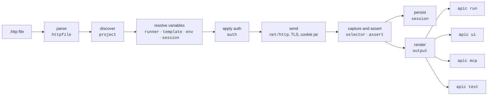

# Architecture

How a request flows through apic, which package does what, and the three
contracts that every change is checked against. Read this before
changing the runner or adding a directive; the last lesson of
[the course](learn/index.md) walks the same ground with a keyboard.

## The lifecycle of a request

1. **Parse** (`internal/httpfile`). A file is split on `###` into blocks;
   each block's comments become directives (`# @name`, `# @assert`,
   `# @capture`, …), then the request line, headers and body are read.
   The parser never fails outright: problems become diagnostics with a
   line, a span and a code, and every request it could read is still
   there. Multipart bodies are read into parts on demand; `apic fmt`
   works from the same regular expressions so the canonical form and the
   parser cannot disagree.
2. **Discover** (`internal/project`). The project root holds `apic.yaml`,
   the env files and `.apic/`; every `*.http` and `*.rest` under it (or
   under `dir:`) is parsed and indexed by name and by `file#N`.
   `Validate` adds the project-level checks: duplicate names, unknown
   selectors, bad auth specs, `# @ref` cycles, missing body files.
3. **Resolve** (`internal/runner`, `template`, `env`, `session`). Every
   `{{placeholder}}` in the URL, headers, body and auth spec is looked up
   in a fixed order: `--var` and `APIC_VAR_*`, values captured in this
   run, the session, the private env file, the public env file, `.env`,
   file `@vars`, then the built-ins (`$uuid`, `$timestamp`, …) and
   `{{name.response.…}}` references. `describe` reports the source of
   each. A missing value stops the request here with exit 2, unless a
   `# @ref` names the request that captures it, which runs first.
4. **Apply auth** (`internal/auth`). `# @auth` (or `auth.default`) is
   parsed into a spec and applied to the outgoing request: a bearer or
   basic header, an AWS SigV4 signature from apic's own signer, an OAuth2
   token fetched and cached in the session, or the output of a command.
   Credentials are set on the wire and never appear in output.
5. **Send** (`net/http`). One attempt per `# @retry` round, with the
   request's timeout, the TLS settings for its host and the cookie jar
   when it is on. Redirects drop credential headers when they leave the
   host. A transport failure is exit 3.
6. **Capture and assert** (`internal/selector`, `internal/assert`). The
   response is read once, bounded by `maxBodyBytes`; `# @capture`
   selectors pull values out of it and `# @assert` expressions are
   evaluated. A failed assertion or capture is exit 1.
7. **Persist** (`internal/session`). Captures are committed to the run
   and to `.apic/session.json` for the environment, and the cookie jar to
   `.apic/cookies.json`, so the next invocation continues where this one
   stopped.
8. **Render** (`internal/output`). One set of renderers produces the
   terminal report, the `--json` line, the UI panes and the MCP result,
   all from the same `Result`, with the same redaction rules.

## The three contracts

| Contract | Where it is enforced |
|---|---|
| **The `.http` dialect** stays what VS Code REST Client and JetBrains send. Everything apic adds is a `# @directive` comment. | `internal/httpfile/testdata/sample.http` (the golden parse), `TestGrammarMatchesKnownDirectives` (the VS Code grammar lists every directive the parser knows), `apic validate` warning on unknown directives rather than failing. |
| **`--json` and exit codes** are stable: keys are only added, and 0/1/2/3 keep their meanings. | `runner.ExitCode` uses `errors.As`, so a wrapped `TransportError` cannot turn a 3 into a 2 (`errorlint` is on for this); `TestExitCodeUnwraps`; the JSON shapes in `internal/runner` are typed and the VS Code extension reads them from `types.ts`. |
| **Every command is non-interactive** and honours `--json`; `apic ui` is the one exception and exits 2 without a terminal. | `apic test` and the CLI tests run with no TTY; device-code and exec prompts write to stderr and never block on stdin. |

## Packages

- `cmd/apic`: entry point
- `internal/httpfile`: `.http` parser (AST in `ast.go`, parser in `parse.go`, multipart bodies in `multipart.go`, the formatter in `format.go`, golden file in `testdata/`)
- `internal/project`: file discovery, `apic.yaml`, request lookup, `validate`
- `internal/env`: `http-client.env.json`, private env file, `.env`, the JetBrains `SSLConfiguration` block
- `internal/template`: `{{placeholder}}` substitution
- `internal/selector`: `status`, `header.x`, `cookie.x`, `body.$.path` selectors
- `internal/assert`: assertion parser and evaluator
- `internal/session`: `.apic/session.json` persistence of captured values and cached tokens, and the cookie jar in `cookies.go`
- `internal/auth`: `# @auth` spec parsing and application for bearer, basic, AWS SigV4 (own signer in `sigv4.go`, credentials in `awscreds.go`; no AWS SDK), OAuth2 grants and exec
- `internal/runner`: variable precedence, request execution, TLS settings (`tls.go`), captures, asserts, retries, `# @ref` dependencies, flows, `describe`
- `internal/output`: the shared theme (`theme.go`), the string renderers used by both the CLI and the UI (`render.go`), JSON highlighting (`jsonhl.go`) and the `io.Writer` wrappers (`output.go`)
- `internal/phrase`: `# @step` phrase to regex
- `internal/bdd`: the `apic test` machinery. Godog suite, step vocabulary (`steps.go`), phrase registration, JSON matching, cucumber-report summary
- `internal/curlexport`, `internal/curlimport`, `internal/openapi`, `internal/postman`, `internal/mcp`: the `curl`, `import` and `mcp` commands. The OpenAPI reader is a small yaml.Node walker (`model.go`) with local `$ref` resolution and the Postman reader a hand-written model; neither uses a library for its format
- `internal/cli`: cobra commands, including `demo`, `init`, `fmt` and `ui`
- `internal/ui`: the `apic ui` terminal UI. Model/update/view live in `ui.go`, `list.go`, `panes.go` and `run.go`, key bindings in `keys.go`, and its own small terminal layer in `term.go` (input decoding), `viewport.go` and `program.go` (event loop). Tests drive `Update`/`View` directly, so no terminal is needed
- `internal/demoapi`: fake in-memory API (auth, API key, a todos CRUD resource with filtering and validation, polled jobs, multipart upload, GraphQL, a CSV report, a slow route, health; the route list is on `New`) and its embedded example project (`project/`), backing the `apic demo` command and its test suite. Every route exists so a lesson or a guide has something offline to run against; keep the project's requests and `features/todos.feature` in step with it
- `examples/`: static sample projects, each `apic validate`-checked and `apic fmt --check`-ed in CI. `httpbin` (basic/bearer auth, needs network but no keys), `github` (bearer auth against a real token), `spotify` (`oauth2` client-credentials against a real app); the last two need the reader's own credentials in their `http-client.private.env.json`
- `editors/vscode/`: the VS Code extension, TypeScript bundled with esbuild, a thin client over the binary's `--json` contract (it never parses `.http` files itself). It injects a grammar for `# @directive` lines into the `http` language REST Client provides rather than owning the language, and bundles the JSON schemas. Released on its own `vscode-v*` tags
- `setup-apic/`: the composite GitHub Action (`uses: dataGriff/api-caller/setup-apic@v0`) that installs a release with the same checksum verification as `install.sh`, on all three runner OSes
- `docs/`: this site (MkDocs Material). The screenshots under `assets/` are generated from real output by `scripts/shot`; the course under `learn/` is one page per lesson whose marked blocks `scripts/learncheck` runs in CI; `scripts/schemas` generates the JSON schemas for `apic.yaml`, the env files and the session file into `docs/schemas` and `editors/vscode/schemas`; `scripts/clidocs` generates the "Commands and flags" section of `cli.md` and the man pages from the command tree

## How to add things

Each of these is a checklist the tests enforce, so a missing step fails
`task check` rather than shipping.

**A directive** (`# @thing value`):

1. Read it in `internal/httpfile` (`ast.go` for a typed accessor, or
   `Request.Directive("thing")`), and add it to `KnownDirectives` in
   `parse.go`; a case in `testdata/sample.http`.
2. Add it to the alternation in
   `editors/vscode/syntaxes/apic-directives.injection.json`;
   `TestGrammarMatchesKnownDirectives` fails otherwise.
3. Give it a rank in `directiveRank` in `format.go` if it has a natural
   place in the canonical order.
4. Act on it in `internal/runner` (or `internal/cli`), with a test beside
   the change; a `validate` check with a code in `httpfile.Codes` if it
   can be wrong.
5. Document it in the directive table of `format.md`, in `cheatsheet.md`,
   and in the codes table of `cli.md` when it has a code.

**A Gherkin step**: its regex and shapes in `internal/phrase/builtin.go`,
a handler bound by name in `internal/bdd/steps.go`, a row in
`bdd.Vocabulary`, a scenario in `bdd_test.go`, and the table in
`testing.md`.

**A command**: a cobra command in `internal/cli` (one file per command)
that respects `--json`, a row in the README table, a section in `cli.md`,
a line in `cheatsheet.md`, and `task docs:cli` to regenerate the flags
reference at the end of `cli.md` and the man pages (`scripts/clidocs`;
its staleness test fails otherwise).

**An `apic.yaml` key**: a field on `project.Config`, a description in
`scripts/schemas/main.go`, and `task schemas` to regenerate the schemas
(their staleness test fails otherwise).

The repository's own conventions for tests, linting, licensing and
releasing are in
[AGENTS.md](https://github.com/dataGriff/api-caller/blob/main/AGENTS.md)
and [CONTRIBUTING.md](https://github.com/dataGriff/api-caller/blob/main/CONTRIBUTING.md).
