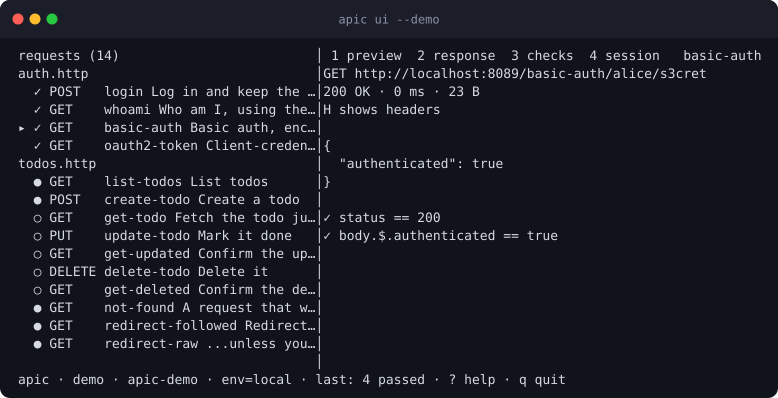

# The terminal UI

`apic ui` is the interactive face of the same project the CLI runs: requests
on the left, and a preview, the response, the checks and the session on the
right. It sends requests with the same runner as `apic run`, so what you see
is what CI will see.

{ .apic-shot }

```sh
apic ui                      # the project in the current directory
apic ui -C api --env staging # a project elsewhere, in another environment
apic ui --demo               # a fake API served in-process, nothing to set up
```

!!! info "The one interactive command"
    Every other apic command is non-interactive and supports `--json`. `apic
    ui` is the exception: it refuses to start when stdout is not a terminal
    or when `--json` is given, and tells you to use `apic run` or `apic list`
    instead. Scripts and agents are never left waiting on a UI.

## Try it with no project

`apic ui --demo` writes the bundled example project to a temporary
directory, serves the fake API it targets on a free localhost port inside
the same process, and opens the UI on it. Quitting shuts the server down and
removes the directory. It is the fastest way to see what apic does, and it
needs no network access.

`apic demo` is the two-terminal version: it writes the same project to
`./apic-demo` (in the current directory) and serves the API. Because `apic
ui` resolves `.http` files relative to `-C` (default: the current
directory), running plain `apic ui` in a second terminal won't see that
project — pass `-C apic-demo` (or `cd` into it first).

## Projects are directory-scoped

Every apic command, `ui` included, only ever looks at `.http`/`.rest` files
under `-C` (default `.`). There is no global registry of projects and no
upward search past that directory. If a request doesn't show up, or the UI
opens empty, check you're pointed at the right directory before anything
else.

## The screen

**Requests** (left) lists every request grouped by file, each row showing
its state, method, id and description:

| Mark | Meaning |
|---|---|
| `●` | Ready to run: every variable it needs resolves. |
| `○` | Not ready: something is missing, usually a token another request captures. |
| `✓` | Ran and passed every assertion and capture. |
| `✗` | Ran and failed, or could not be sent at all. |
| spinner | In flight. |

Once a request has run, its status code and round trip sit at the right of
the row (`200 12ms`), and the file heading above it rolls its requests up
as `✓9 ✗1`, so a flow over a long file reads at a glance. A narrow pane
sheds the timing first and the description second; the status code and the
mark always stay. The colour of a status code is its class, not its verdict:
a `404` a request asserts is still a `✓`.

**Preview** is `apic describe` for the selected request: the URL template,
headers, the body, auth, every variable with the source it resolved from,
and the declared captures and asserts. Missing variables are called out with
the request that would provide them.

**Response** is the status line, timing and size, the body pretty-printed
and syntax-highlighted, and the assertions and captures underneath. <kbd>H</kbd>
adds the request and response headers; <kbd>c</kbd> swaps in the equivalent
curl command. When a tab holds more than fits, the right of the tab strip
says where you are in it: `top ↓`, `↑ 40% ↓`, `↑ end`.

**Checks** shows each assertion with its actual *and* expected value, which
is the fastest way to see why a check failed, plus everything the request
captured.

**Session** lists the values captured for the current environment, the same
ones `apic session` prints and the same ones later runs will use. <kbd>x</kbd>
clears them after a confirmation.

The status bar carries the project root, the environment, a spinner with
progress and a running clock while a request is out, and the result of the
last run. `demo` and `redact` badges show when `--demo` or `--redact` is in
force, so a screenshot never hides that values were masked.

## Keys

| Key | Action |
|---|---|
| <kbd>↑</kbd>/<kbd>k</kbd>, <kbd>↓</kbd>/<kbd>j</kbd> | Move between requests |
| <kbd>g</kbd>, <kbd>G</kbd> | First and last request |
| <kbd>/</kbd> | Filter by id, URL, method, file or description |
| <kbd>enter</kbd> | Run the selected request |
| <kbd>f</kbd> | Run every request in its file, in order, as a flow |
| <kbd>a</kbd> | Run every request in the project |
| <kbd>esc</kbd> | Cancel a run, clear the filter, or close an overlay |
| <kbd>tab</kbd>/<kbd>l</kbd>, <kbd>shift+tab</kbd>/<kbd>h</kbd> | Next and previous tab |
| <kbd>1</kbd> <kbd>2</kbd> <kbd>3</kbd> <kbd>4</kbd> | Jump to preview, response, checks, session |
| <kbd>H</kbd> | Toggle request and response headers |
| <kbd>c</kbd> | Toggle the curl command for the selected request |
| <kbd>J</kbd>, <kbd>K</kbd> | Scroll the right pane a line down or up |
| <kbd>pgup</kbd>/<kbd>ctrl+u</kbd>, <kbd>pgdn</kbd>/<kbd>ctrl+d</kbd> | Scroll the right pane half a page |
| <kbd>e</kbd> | Switch to the next environment |
| <kbd>r</kbd> | Reload the project from disk |
| <kbd>o</kbd> | Open the request's file at its line in `$EDITOR` |
| <kbd>x</kbd> | Clear the session for this environment |
| <kbd>?</kbd> | Show every key |
| <kbd>q</kbd>, <kbd>ctrl+c</kbd> | Quit |

## How it behaves

- **One request at a time.** Runs are serialised, because they share the
  session and the values captured along the way. Starting a run while one is
  in flight says so rather than queueing; <kbd>esc</kbd> cancels.
- **Flows update live.** Running a file sends its requests one after
  another, and each row turns green or red as its response arrives, so a long
  flow shows progress instead of a frozen screen.
- **Captures apply immediately.** After `login` passes, requests that need
  `{{token}}` flip from `○` to `●` without a reload.
- **Scrolling stays put.** Reading down a long response and it finishes
  changing underneath you (a later step of a flow landing, the terminal
  being resized) leaves you where you were. Moving to another request, tab
  or overlay starts at the top again.
- **Switching environment rebuilds the project** with that environment's
  variables and session, and clears the results on screen, since they came
  from somewhere else.
- **Editing is round-tripped.** <kbd>o</kbd> opens `$VISUAL`, then `$EDITOR`
  (`vi`, or `notepad` on Windows), at the request's line; the project is
  reloaded when the editor exits. <kbd>r</kbd> reloads without editing, which
  picks up files written by anything else.
- **Redaction is honoured.** With `--redact`, bodies, header values, query
  values and captured values are masked on screen exactly as they are in
  `apic run --redact` output.

## If it will not start

`apic ui` needs an interactive terminal on both stdin and stdout.

- "needs an interactive terminal" means stdout is a pipe or a file. Drop the
  pipe, or use `apic run`/`apic list --json` for scripted work.
- "does not support `--json`" means exactly that: the UI has no machine
  output. `apic run --json` and `apic list --json` do.
- On Windows, run it in Windows Terminal or PowerShell. Git Bash's mintty
  needs `winpty apic ui`.
- Below 70x16 the UI says the terminal is too small rather than drawing a
  scrambled screen.

!!! note "About the screenshot"
    The picture at the top is not a drawing. `task shots` serves the demo
    API in process, drives the UI the way the keys above do, and renders the
    frame it produces, escape codes and all, as SVG, so what the docs show
    is what the terminal shows. The moving picture on the [home page](index.md)
    and the README is made the same way: twenty such frames captured after
    real key presses, cycled with SVG's own timing, so it needs no GIF and
    cannot drift from what the UI draws.
